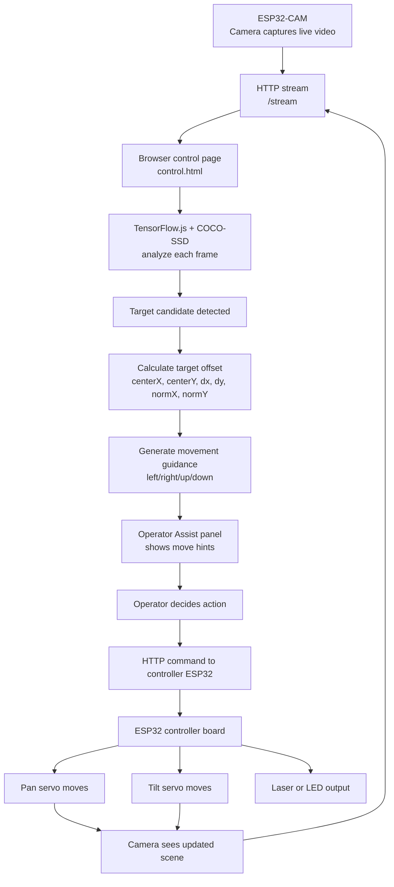
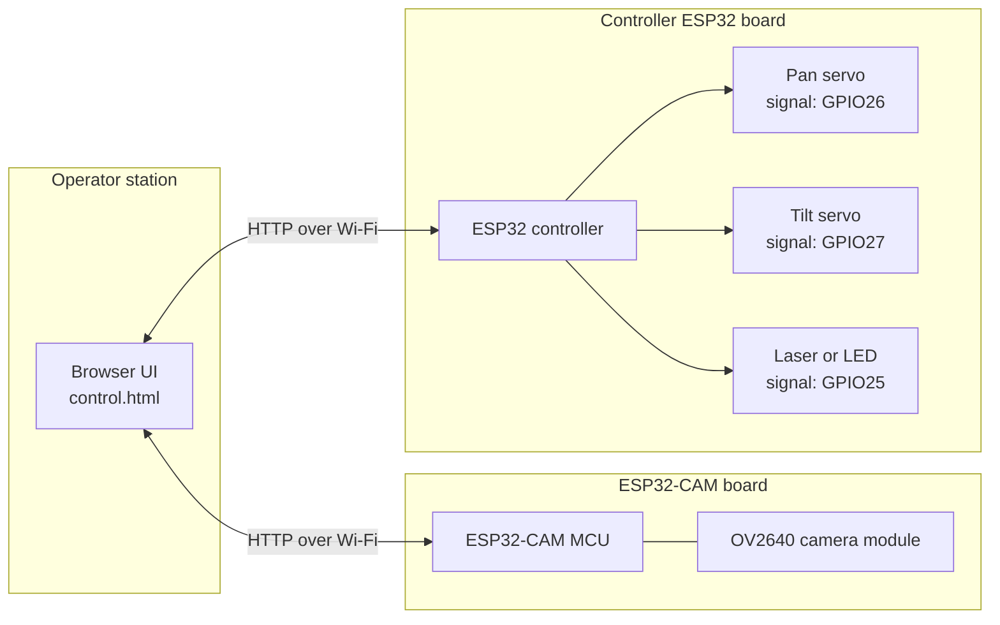

# SkyShield System Diagram

This document summarizes the project flow and the electronic component layout based on the current firmware and web UI.

## Operational flow

## Electronic components diagram

## Wiring notes

- Controller ESP32 `GPIO26` drives the X-axis servo signal.
- Controller ESP32 `GPIO27` drives the Y-axis servo signal.
- Controller ESP32 `GPIO25` drives the laser or LED output.
- The ESP32-CAM provides the video stream and does not drive the servos directly.
- Use a common ground between the controller ESP32 and the servo power source.
- Powering the servos from an external regulated supply is recommended for stability.

## Source basis

- Controller firmware: `code/firmware/skyshield_controller/skyshield_controller.ino`
- Camera firmware: `code/firmware/ai_thinker_cam_http80/ai_thinker_cam_http80.ino`
- Web UI logic: `code/js/pages/control.js`
